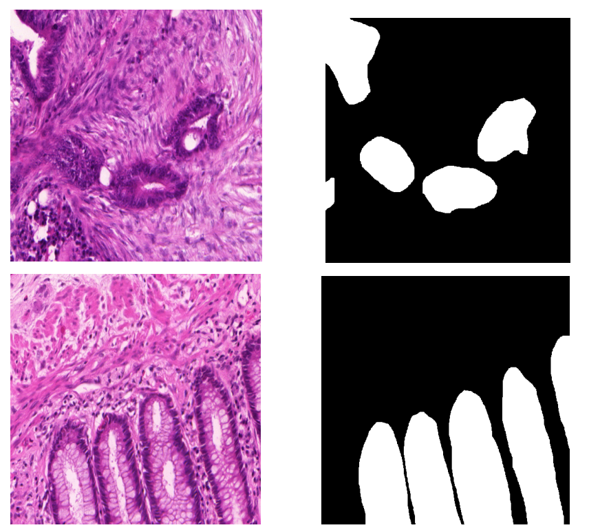
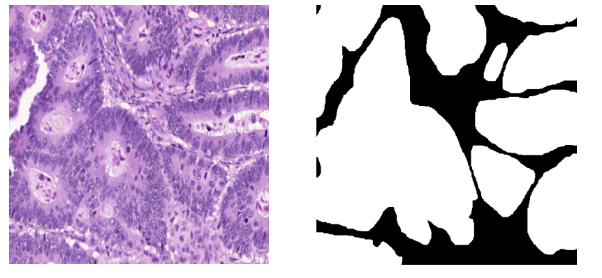
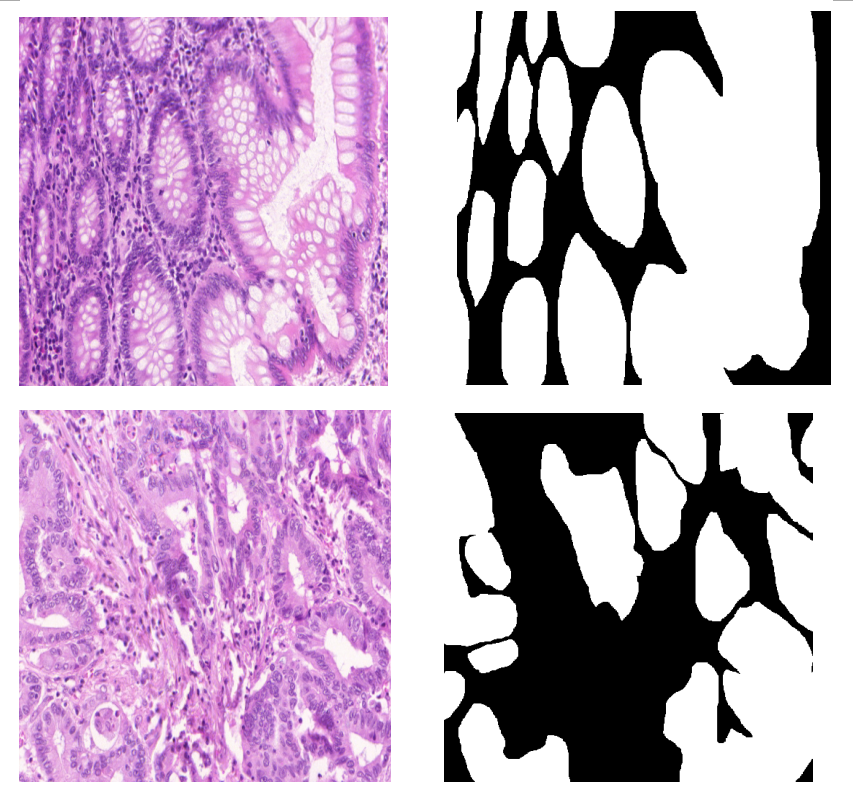

# ImageSegmentation With Unet2d
> This is an example of Medical Image Ceil Segment

## How to Use

the image files path is in the csv files,and put the image on the path,use the glandceilunet2dtest.py file train the model. 

training the model on the GTX1080,it take 20 hours,and i also attach the trained model in the project,you also just use the glandceilunet2dtest.py file to predict,and get the segmentation result.

download trained model : https://pan.baidu.com/s/17p5lNKSNfWvFtn1KujjVbQ passport: hto4
download trained data : https://pan.baidu.com/s/13GVSr8FXSKmNsWVCG0FxXQ passport: uzxe

## Result

## Contact
* https://github.com/junqiangchen
* email: 1207173174@qq.com
* WeChat Public number: 最新医学影像技术
